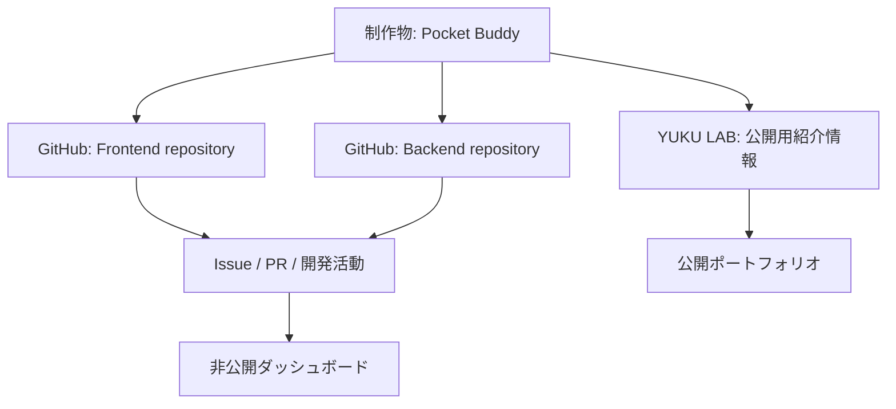
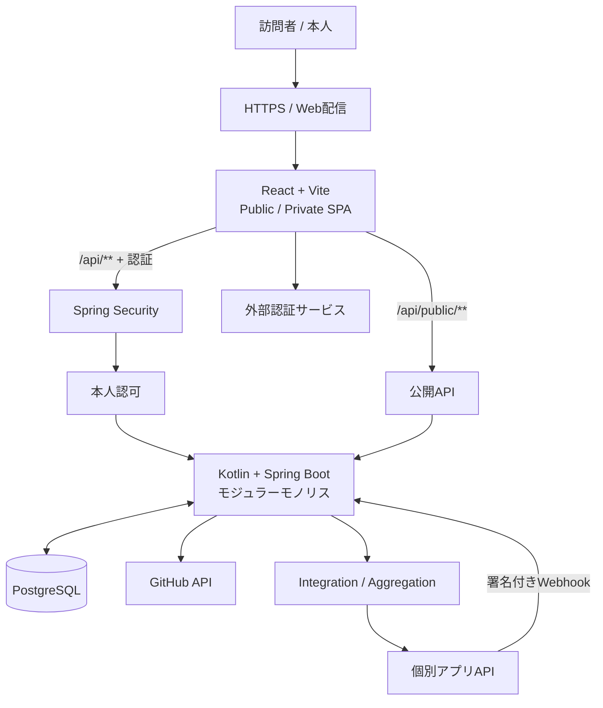
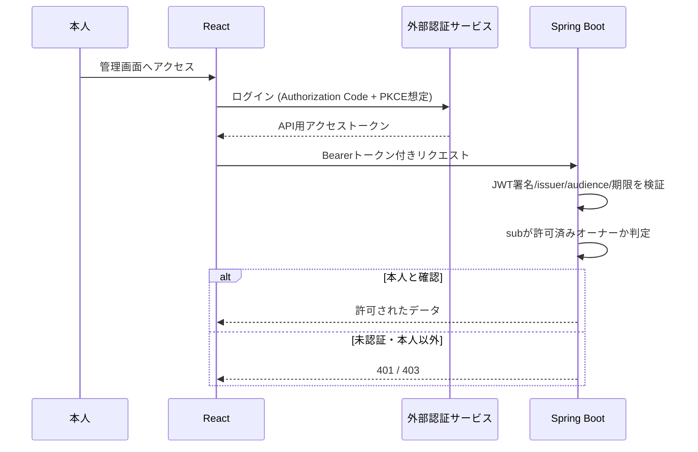
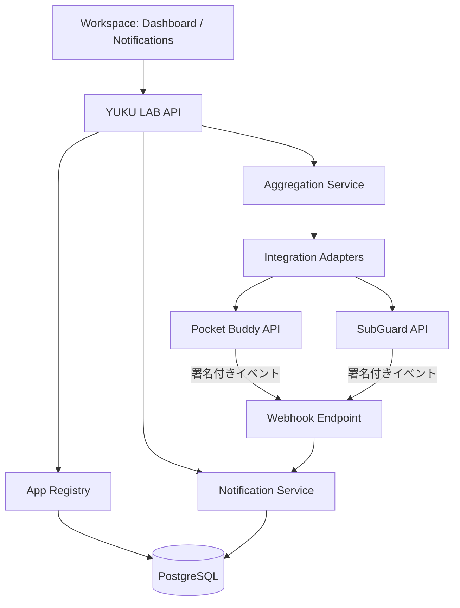
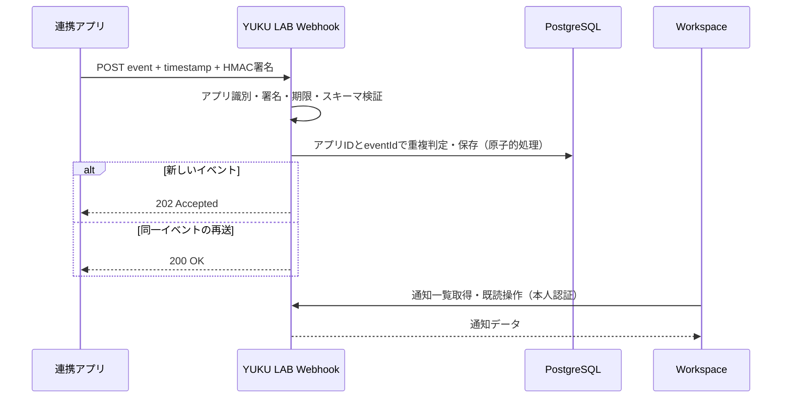
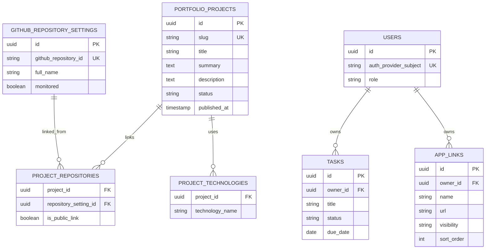
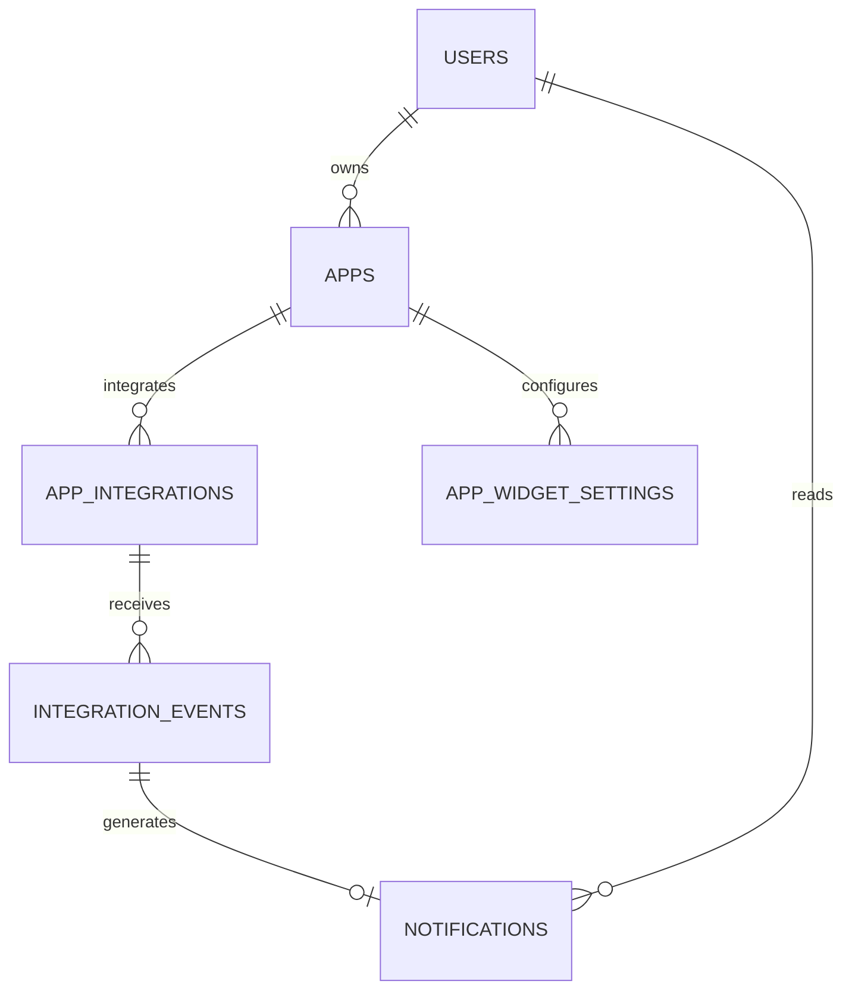
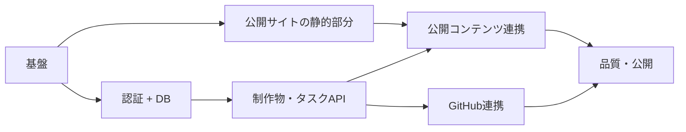

# YUKU LAB 設計書

> Version: 1.2 / 作成日: 2026-09-21 / 更新日: 2026-09-21  
> 状態: 要件・基本設計のドラフト。実装前に「未決定事項」を確認する。

## 1. 概要

### 1.1 コンセプト

**つくる、試す、積み重ねる。自分の活動を管理し、開発の成果を外部に発信する個人プラットフォーム。**

正式名称: **YUKU LAB**（ユクラボ）、ロゴ表記: **YUKU LAB.**、リポジトリ名: `yuku-lab`。公開領域はPortfolio / Works / Journal、本人用領域はWorkspace。

YUKU LABは次の2つを同じ程度に重視する。

- **Private:** 本人が日常的に利用するタスク・予定・開発情報・アプリへの入口。
- **Public:** 採用担当者・エンジニアに向けた自己紹介、制作物、技術記事の公開。

GitHubの代替開発管理ツールは作らない。GitHubのIssue・PR・リポジトリを読み取って横断表示し、公開用の制作物紹介だけをYUKU LABで編集する。

### 1.2 想定利用者と目的

| 利用者 | 主な目的 |
| --- | --- |
| 本人 | 日常タスク・予定の確認、GitHub活動の横断把握、個人アプリへのアクセス |
| 採用担当者 | 経歴、技術スタック、制作物、開発経験の概要を把握 |
| エンジニア | ソースコード、設計判断、実装の工夫、技術記事を確認 |

### 1.3 設計原則

1. GitHubを開発管理の**正本（Source of Truth）**とし、Issue・PR・開発タスクを二重管理しない。
2. 制作物とリポジトリは1対1に限定しない。1作品に複数のリポジトリを関連付けられる。
3. 公開情報は明示的に選択し、非公開データをそのまま公開APIへ流さない。
4. 日常タスクは開発Issueと独立させ、ダッシュボードで必要に応じて集約表示する。
5. 初期段階は単一ユーザー・単一バックエンドのシンプルな構成とする。
6. 個人開発の維持負担を抑え、段階的に機能を増やす。

---

## 2. スコープ

### 2.1 MVPに含める機能

| 領域 | 機能 | 備考 |
| --- | --- | --- |
| 公開 | トップ・自己紹介・経歴概要・技術スタック | 未ログインで閲覧可能 |
| 公開 | 制作物一覧・詳細 | 公開済み情報のみ |
| 公開 | Markdown技術ブログ | 初期はGitで執筆・公開 |
| 非公開 | 本人ログイン | 外部認証サービスを利用 |
| 非公開 | 今日・今週のタスク管理 | CRUD、完了、期限。GitHub Issueとは別 |
| 非公開 | 開発ダッシュボード | 登録対象リポジトリのIssue・PR・最近の活動を集約 |
| 非公開 | 制作物紹介の編集・公開管理 | DB管理、複数リポジトリ関連付け |
| 非公開 | アプリランチャー | アプリ機能の移植はしない。連携機能は別段階で追加 |
| 共通 | レスポンシブ対応、アクセス制御、エラー表示 | PC・スマートフォン |

※「日々の予定」はMVPでは期限付きタスクの表示、または最小限の手動予定表示まで。独立した予定CRUDを追加するかは未決定。

### 2.2 後続フェーズ

| フェーズ | 機能 |
| --- | --- |
| Phase 2 | RSS技術ニュース、既読・あとで読む、Google Calendar等との連携 |
| Integration MVP（本体MVP後） | アプリ登録、共通サマリー取得、Webhook受信、通知一覧・既読管理を1アプリで検証 |
| Integration Phase 2 | 2アプリ以上の横断集約、専用アダプターの実証 |
| Integration Phase 3 | 通知ルール、リアルタイム配信、再試行キュー、高度なキャッシュ管理 |
| Phase 3 | 家計簿等の個別アプリ連携や必要に応じたAI要約 |
| 将来検討 | GitHub Projectsカスタムフィールド、Issue更新、記事編集UI、アプリ横断検索 |

**非目標（MVP）:** GitHubを置き換えるIssue/PR編集機能、独自カンバン、家計簿の再実装、マイクロサービス化、多人数向けSaaS化。

---

## 3. 情報の正本と公開方針

| データ | 正本・管理場所 | YUKU LABでの役割 | 公開方針 |
| --- | --- | --- | --- |
| GitHubリポジトリ | GitHub | 監視対象登録・作品との紐付け・閲覧 | 許可した公開リポジトリのリンクのみ |
| Issue・PR | GitHub | 読み取り・横断表示 | 原則Private画面内のみ |
| 開発活動 | GitHub | Issue数、PR数、更新日時などを表示 | 公開ページへ自動転載しない |
| 制作物紹介 | YUKU LAB DB | 紹介文、技術、設計、成果を編集 | 明示的に公開したもののみ |
| 日常タスク | YUKU LAB DB | 登録・更新・完了 | 非公開 |
| 技術記事 | Markdown + Git | ビルドして公開 | 公開対象ファイルのみ |
| 家計簿 | 個別アプリ（例: Pocket Buddy） | リンク・認証済みAPIからのサマリー集約 | 非公開 |
| 通知の発生源となる事実 | 各個別アプリ | 受信イベント・通知表示と既読管理 | 非公開 |
| 連携設定・通知既読 | YUKU LAB DB | 登録・変更・イベント重複排除 | 非公開 |

### 3.1 「プロジェクト」の定義

**制作物（ポートフォリオ上のプロジェクト）**とは、1つの開発活動またはアプリ・サービスを紹介する単位。複数GitHubリポジトリを束ねられる。開発進捗の正本はGitHubであり、YUKU LABは独自のIssueやPRを保存・編集しない。



**注意:** Issue完了件数の割合をプロジェクトの進捗率とは見なさない。未完了件数・完了件数・PR・最近の更新を指標としてそのまま表示する。

---

## 4. システム構成

### 4.1 技術スタック

| レイヤー | 技術 | 状態・目的 |
| --- | --- | --- |
| Frontend | React / TypeScript / Vite | 確定。Next.jsは使用しない |
| Styling | Tailwind CSS | 確定。完成済みUIコンポーネントライブラリは原則使わず共通部品を自作 |
| Routing | React Router | 採用案 |
| データ取得 | TanStack Query + fetch | 採用案 |
| Backend | Kotlin / Spring Boot | 採用案。REST APIを提供 |
| API認証・認可 | Spring Security | 採用案。JWT検証・本人確認 |
| DB | PostgreSQL | 採用案 |
| 永続化 | Spring Data JPA | 採用案 |
| Migration | Flyway | 採用案 |
| API仕様 | OpenAPI | 採用案 |
| 外部認証 | 認証サービス | 方針確定、**製品は未確定**。Auth0が候補 |
| FEテスト | Vitest | 採用案 |
| BEテスト | JUnit / Testcontainers | 採用案 |
| ローカル環境 | Docker Compose | 採用案 |
| CI | GitHub Actions | 採用案 |
| 本番ホスティング | 未定 | 費用・運用負担を比較して決定 |



**ホスティングの目標構成:** 静的Web配信 + コンテナ化したAPI + マネージドPostgreSQL。可能ならリバースプロキシで`/api/*`をAPIへ転送し同一オリジンにするが、実際のホスティング決定に依存する。

### 4.2 URL

| URL | ページ | アクセス |
| --- | --- | --- |
| `/` | 公開トップ | Public |
| `/about` | 自己紹介 | Public |
| `/projects` | 制作物一覧 | Public |
| `/projects/:slug` | 制作物詳細 | Public |
| `/blog` | 記事一覧 | Public |
| `/blog/:slug` | 記事詳細 | Public |
| `/app` | ダッシュボード | Owner |
| `/app/tasks` | 日常タスク | Owner |
| `/app/projects` | 制作物紹介の管理 | Owner |
| `/app/github` | リポジトリ・Issue・PR横断閲覧 | Owner |
| `/app/apps` | アプリ登録・連携設定 | Owner |
| `/app/notifications` | 統合通知センター | Owner |

### 4.3 公開ページとSEO

公開トップ、自己紹介、記事、制作物のHTMLをビルド時にプリレンダリングする方針。**Viteの通常のSPAビルドだけで全動的ルートが自動的に静的生成されるわけではない**ため、プリレンダリング手段とビルド時データ取得を別途決定する。ダッシュボードはSPAでよい。

- ページごとのtitle / description / OGP、サイトマップを用意。
- 制作物の公開内容をDBから静的生成する場合、再ビルド・再デプロイが完了して初めて公開反映とみなす。
- 非公開化時に生成HTML・検索用URL・CDNキャッシュが残らない仕組みを実装。即時非公開が必要な場合は配信方式自体を見直す。
- 公開APIの最新状態と静的HTMLの状態が異なる期間をどう扱うかは、実装前に決める。

---

## 5. 認証・セキュリティ

### 5.1 基本方針

- 外部認証サービスを使用し、パスワード認証の自作はしない。
- 単一オーナー運用。**ログイン成功と管理権限は別判定**とする。
- Spring BootはJWT署名・issuer・audience・有効期限を検証し、許可済みユーザー`sub`を照合する。
- Public API以外は原則本人にのみ許可する。
- トークンをlocalStorageに永続保存しない。GitHub認証情報はブラウザへ返さずサーバー側で保護する。
- CSRFの要否は最終的なトークン受け渡し方式で判定する。Cookie方式に変更する場合はCSRF対策も設計する。



**GitHub連携はログインとは別機能。** 外部認証サービスへのログインによってGitHub API権限が自動的に得られると仮定しない。GitHub App等の最小権限の読み取り方法を決定する。

### 5.2 公開情報の漏洩防止

- Public APIは公開専用DTOからレスポンスを作成し、管理用Entityをそのまま返さない。
- 非公開リポジトリの名前・URL・Issue本文・トークン・内部メモを公開レスポンスに含めない。
- 公開状態はサーバー側で検証。フロントの表示切替だけに頼らない。
- 公開・非公開切替をAPI・静的配信・キャッシュまで通してE2Eテストする。

---

## 6. 機能要件詳細

### 6.1 開発ダッシュボード（Private）

| ID | 要件 |
| --- | --- |
| GH-01 | 監視対象リポジトリを登録・解除できる |
| GH-02 | 複数リポジトリを横断してIssueを閲覧できる |
| GH-03 | 複数リポジトリを横断してPRを閲覧できる |
| GH-04 | ステータス・更新日時・原本へのリンクを表示する |
| GH-05 | 最近の開発活動を確認できる |
| GH-06 | GitHub APIの障害・権限不足・レート制限を識別して表示する |

Issue・PRの作成・編集・クローズはGitHubで行う。GitHub Projectsの高度な同期はMVP対象外。

### 6.2 制作物紹介管理（Private）

| ID | 要件 |
| --- | --- |
| PF-M01 | 作品名・slug・概要・詳細・公開ステータスを登録・編集できる |
| PF-M02 | 1制作物に複数リポジトリを紐付けられる |
| PF-M03 | リポジトリへの公開リンク可否を個別に指定できる |
| PF-M04 | 技術スタック・デモURL・関連記事等を設定できる |
| PF-M05 | 公開/非公開を明示的に切り替えられる |
| PF-M06 | 公開反映・非公開化の完了状態を確認できる |

### 6.3 公開ポートフォリオ

| ID | 要件 |
| --- | --- |
| PF-P01 | プロフィール・経歴概要・技術を表示できる |
| PF-P02 | 公開済み制作物だけを一覧表示できる |
| PF-P03 | 作品詳細で「背景→課題→技術→設計→工夫→成果/学び→リンク」を紹介できる |
| PF-P04 | GitHub・デモへのリンクを表示できる。ただし明示的に許可されたURLのみ |
| PF-P05 | 未完成作品には事実に即した「企画中/開発中/公開中」等を表示できる |

### 6.4 その他のMVP

- **日常タスク:** タイトル・説明・期限・状態のCRUD、今日/今週の一覧。GitHub Issueとの自動同期はしない。
- **アプリリンク集:** アプリ名・説明・URL・表示順・公開範囲を管理。リンク先アプリ本体は移植しない。
- **ブログ:** Markdownで執筆しGitで管理。コード表示、タグ、記事一覧・詳細に対応。管理画面エディタは不要。
- **ダッシュボード:** 今日のタスク、開発情報、アプリへのショートカットを集約。各外部機能の失敗が画面全体を止めない。

---

### 6.5 Integration Hub（本体MVP後の連携MVP）

**決定した利用体験:** 複数アプリの情報を組み合わせて表示し、アプリからYUKU LABへ通知を送信できるようにする。アプリ本体の業務データ・ロジックは各アプリが正本として保持し、YUKU LABは連携設定・横断集約・受信通知を担当する。SSOとアプリへの書き込み操作は必須範囲外。

| ID | 要件 | 段階 |
| --- | --- | --- |
| INT-01 | アプリ名・説明・起動URL・表示順を登録する | 本体MVP |
| INT-02 | 共通契約に対応するアプリを管理画面の設定で追加できる | Integration MVP |
| INT-03 | 特殊なAPIには専用アダプターをコード追加して対応できる | Integration Phase 2で実証 |
| INT-04 | 認証済みサーバー間通信でアプリのサマリーを取得する | Integration MVP |
| INT-05 | 2アプリ以上のサマリーを意味・期間・単位を確認して横断集約する | Integration Phase 2 |
| INT-06 | 署名付きWebhookでアプリのイベントを受信する | Integration MVP |
| INT-07 | 通知一覧・未読件数・既読操作を提供する | Integration MVP |
| INT-08 | 外部API障害時はウィジェット単位で失敗表示し、全体を停止しない | Integration MVP |

**追加方式:** (A) 許可済み共通契約に対応するアプリは設定型、(B) 特殊な変換が必要なアプリは専用アダプター型。任意URLへの無制限HTTPリクエストを許可する汎用実行機能は作らない。接続先のallowlist、HTTPS、プライベートIP・リダイレクト・DNS再解決への対策を設ける。専用アダプターはコードレビューとデプロイを伴う。



**サマリー契約（例）:** `appId`、`summaryType`、`asOf`、`schemaVersion`、`data`を含む。`data`は種別ごとの検証済みスキーマを採用し、異なる通貨・対象期間・すでに計上済みの支出を無条件に合算しない。家計簿×契約管理による参考残額は実証ユースケースであり、対象アプリ側のAPI実装が前提。

**通知共通契約:** `eventId`、`eventType`、`occurredAt`、`notification.title`、`notification.message`、`notification.severity`、`notification.actionPath`。送信元アプリIDは署名検証に成功した連携設定からサーバーが確定する。`actionPath`は登録済みベースURLに対する相対パスのみを許可する。



Webhook鍵はアプリごとに管理し、平文を通常テーブル・ログ・ブラウザに出さない。タイムスタンプ許容期間を設け、送信元アプリ＋イベントIDに一意制約を適用する。検証失敗は拒否し、処理失敗時は送信側がバックオフ付き再送を実施する。MVPはDB保存・画面での取得方式とし、WebSocketは後回しにする。保存する通知に秘密情報や過剰な個人データを含めない。

---

## 7. データ設計（概念設計）

以前の「独自開発管理用`projects`」は廃止。制作物の公開紹介情報を`portfolio_projects`で管理し、GitHub情報は取得元を正本とする。ただし**監視対象・紐付け設定は内部管理データとしてDBに保持する**。「公開情報のみDB管理」はIssue/PR等の開発実績を複製しないという意味であり、設定値まで一切保存しないという意味ではない。



### 7.1 主な制約

- `portfolio_projects.slug`は一意。`published_at`が設定され、公開状態が有効な作品のみPublic APIへ返す（正確な状態表現は実装時に確定）。
- `project_repositories`は複合一意制約（project_id, repository_setting_id）を設定する。
- リポジトリのGitHub IDを外部識別子に使用し、表示名の変更に備える。
- 技術スタックの重複を防ぐ一意制約を設定する。
- 記事はMVPではMarkdownに保持し、記事DBテーブルを設けない。
- GitHub Issue・PRの複製テーブルは設けない。必要になればキャッシュ設計を追加する。
- 日常タスクにGitHubのproject_idを付与しない。

---

### 7.2 Integration Hub 追加テーブル（追加設計）

| テーブル | 主なフィールド・責務 |
| --- | --- |
| `apps` | `id`, `owner_id`, `name`, `description`, `launch_url`, `visibility`, `sort_order`。既存の`app_links`を拡張・移行する想定 |
| `app_integrations` | `id`, `app_id`, `adapter_type`, `approved_base_url`, `status`, `last_fetched_at`, `secret_ref`。シークレットそのものは保存しない |
| `app_widget_settings` | `id`, `owner_id`, `app_id`, `widget_type`, `sort_order`, `enabled` |
| `integration_events` | `id`, `integration_id`, `external_event_id`, `event_type`, `received_at`, `status`。`(integration_id, external_event_id)`一意 |
| `notifications` | `id`, `owner_id`, `integration_event_id`, `title`, `message`, `severity`, `action_path`, `created_at`, `read_at` |

既存の`app_links`は直ちに削除せず、移行マイグレーションで`apps`に統合する。上記は概念設計で、実装時に外部キー、削除方針、保持期間、インデックスを確定する。サマリーの全量永続化はせず、必要時のみTTL付きキャッシュを別途導入する。



## 8. API設計（初期案）

以下はパスと責務の設計。DTOの全フィールド、ページング、フィルタ、エラーコードはOpenAPI定義時に詳細化する。

### 8.1 Public

| Method | Endpoint | 説明 |
| --- | --- | --- |
| GET | `/api/public/projects` | 公開済み制作物一覧 |
| GET | `/api/public/projects/{slug}` | 公開済み制作物詳細 |

### 8.2 Owner

| Method | Endpoint | 説明 |
| --- | --- | --- |
| GET | `/api/me` | 本人ログイン状態 |
| GET | `/api/github/repositories` | 監視対象リポジトリ一覧 |
| GET | `/api/github/issues` | Issue横断一覧 |
| GET | `/api/github/pulls` | PR横断一覧 |
| GET | `/api/portfolio/projects` | 制作物の管理一覧 |
| POST | `/api/portfolio/projects` | 制作物登録 |
| PATCH | `/api/portfolio/projects/{id}` | 公開情報編集 |
| PUT | `/api/portfolio/projects/{id}/repositories` | リポジトリ紐付け更新 |
| POST | `/api/portfolio/projects/{id}/publish` | 公開処理を開始 |
| POST | `/api/portfolio/projects/{id}/unpublish` | 非公開処理を開始 |
| GET / POST | `/api/tasks` | 日常タスク一覧 / 作成 |
| PATCH / DELETE | `/api/tasks/{id}` | 日常タスク更新 / 削除 |
| GET / POST | `/api/apps` | アプリリンク一覧 / 登録 |
| PATCH / DELETE | `/api/apps/{id}` | アプリリンク更新 / 削除 |

監視対象リポジトリの登録/解除API（例:`/api/github/repository-settings`）は、GitHub Appの権限設計に合わせて追加する。

- `/api/public/**`のみ認証不要とし、公開用DTOで最小情報を返す。
- 管理APIはJWT検証とOwner認可を必須とする。
- 入力バリデーション、例外レスポンス、ページング、レート制限を統一する。
- 公開操作は静的HTML反映までの非同期性を含むため、API成功＝公開配信完了と断定しない。反映状態の表現方法は未決定。

---

### 8.3 Integration Hub（追加API）

| Method | Endpoint | 認可・役割 |
| --- | --- | --- |
| GET / POST | `/api/apps` | 本人: 一覧・登録（既存APIを維持） |
| PATCH / DELETE | `/api/apps/{id}` | 本人: 更新・削除 |
| GET | `/api/apps/{id}/summary` | 本人: アプリ個別サマリー |
| GET | `/api/dashboard/overview` | 本人: 横断集約結果（Phase 2） |
| GET | `/api/notifications` | 本人: 通知一覧・未読件数 |
| PATCH | `/api/notifications/{id}/read` | 本人: 既読処理 |
| POST | `/api/integrations/events` | 連携アプリ: アプリ別署名検証・重複排除。本人用JWTではなく送信元認証を適用 |

アプリ登録・接続テスト・ウィジェット設定APIの詳細パスとDTOはOpenAPI化時に確定する。イベントAPIは公開ポートフォリオ用の無認証APIではない。適切なペイロード制限・レート制限・タイムアウト・監査ログを適用する。

## 9. コード・リポジトリ構成

モノレポ。各アプリは個別にビルド・デプロイ可能とする。

```text
personal-hub/
├── frontend/
│   ├── public/
│   └── src/
│       ├── app/             # Router / Provider
│       ├── features/        # portfolio, dashboard, github, tasks, auth...
│       ├── components/ui/   # Tailwindで作る共通UI部品
│       ├── lib/api/
│       └── styles/
├── backend/
│   └── src/main/kotlin/.../
│       ├── auth/
│       ├── portfolio/
│       ├── github/
│       ├── task/
│       ├── app/
│       └── common/
├── content/blog/            # Markdown記事（配置は仮）
├── docs/
│   ├── requirements/
│   ├── architecture/
│   ├── api/
│   └── adr/
├── infra/compose.yaml
├── .github/workflows/
└── README.md
```

バックエンドはモジュラーモノリスで開始する。機能内は必要に応じて`presentation / application / domain / infrastructure`へ分けるが、早期の過剰な抽象化は避ける。ADRに技術選定と設計判断を記録する。

---

## 10. 開発計画・Issue化するタスク

### Epic 01: 基盤

- [ ] DEV-001 モノレポとREADME作成
- [ ] DEV-002 React + Vite + TypeScriptセットアップ
- [ ] DEV-003 Tailwind CSS・共通レイアウト作成
- [ ] DEV-004 Kotlin + Spring Bootセットアップ
- [ ] DEV-005 PostgreSQL / Docker Compose / Flywayセットアップ
- [ ] DEV-006 GitHub ActionsでFE・BEビルド/テスト

### Epic 02: 公開サイト

- [ ] PORT-001 公開トップ・自己紹介・技術スタック
- [ ] PORT-002 制作物一覧・詳細のUI
- [ ] PORT-003 Markdownブログの表示
- [ ] PORT-004 title・description・OGP・サイトマップ
- [ ] PORT-005 プリレンダリング手法を確定し導入
- [ ] PORT-006 スマートフォン・キーボード操作・アクセシビリティ確認

### Epic 03: 認証

- [ ] AUTH-001 認証サービスを選定しSPA/APIを設定
- [ ] AUTH-002 Reactのログイン/ログアウト
- [ ] AUTH-003 Spring SecurityでJWT検証
- [ ] AUTH-004 オーナー認可を実装
- [ ] AUTH-005 401/403、他ユーザーのアクセス拒否をテスト

### Epic 04: 制作物・タスク

- [ ] CORE-001 DBマイグレーション・一意制約
- [ ] CORE-002 制作物紹介CRUD API
- [ ] CORE-003 複数リポジトリ関連付け
- [ ] CORE-004 公開専用DTO、公開・非公開制御
- [ ] CORE-005 日常タスクCRUD API / UI
- [ ] CORE-006 制作物紹介の管理UI
- [ ] CORE-007 ダッシュボード集約画面
- [ ] CORE-008 アプリリンク管理

### Epic 05: GitHub連携

- [ ] GH-001 GitHub App等の権限・認証方式決定
- [ ] GH-002 監視対象リポジトリ登録・解除
- [ ] GH-003 Issue・PR取得API
- [ ] GH-004 リポジトリ横断一覧UI
- [ ] GH-005 API障害・レート制限・権限不足対応

### Epic 06: リリース・品質

- [ ] REL-001 ホスティング候補と月額費用・運用条件を比較
- [ ] REL-002 HTTPS・独自ドメイン・環境変数・秘密情報管理
- [ ] REL-003 DBバックアップ/復元手順
- [ ] REL-004 公開内容更新・非公開化・キャッシュ削除の運用
- [ ] REL-005 公開漏洩防止・認証認可・E2Eテスト
- [ ] REL-006 本番公開と監視・エラー確認

### 推奨着手順



**Sprint 1完了条件:** FE起動、BEヘルスチェック、ComposeでDB起動、BEからDB接続、FE→APIの疎通、GitHub Actionsで基本テスト成功。

---

### Epic 07: Integration Hub（本体MVP後）

- [ ] INT-001 共通サマリー・イベント契約とバージョン定義
- [ ] INT-002 App Registry・連携設定・許可先制御
- [ ] INT-003 設定型HTTPアダプターと接続テスト
- [ ] INT-004 専用アダプター拡張ポイント（Phase 2で実証）
- [ ] INT-005 個別サマリー取得・障害分離
- [ ] INT-006 Webhook署名・期限・ペイロード検証
- [ ] INT-007 重複排除とイベント・通知の原子的保存
- [ ] INT-008 通知一覧・未読・既読UI
- [ ] INT-009 複数アプリの横断集約ビュー（Phase 2）
- [ ] INT-010 接続先制限・再送・認可・障害時の結合テスト

**連携MVP受け入れ条件:** 1アプリの登録・サマリー表示・署名付き通知・既読操作が動作し、重複イベントが二重登録されず、障害時もWorkspace全体が表示可能。**Phase 2受け入れ条件:** 2アプリ以上のデータから意味のある統合ビューを構築でき、設定型と専用アダプター型を実証する。

---

## 11. MVP受け入れ基準

- [ ] 公開トップ・自己紹介・制作物・ブログは未ログインで閲覧可能。
- [ ] 非公開制作物・リポジトリ情報はPublic API・静的HTMLに含まれない。
- [ ] オーナー以外は管理APIを利用できない。
- [ ] 日常タスクを登録・編集・完了・削除できる。
- [ ] 1制作物に複数のGitHubリポジトリを紐付けられる。
- [ ] Issue・PRを横断閲覧でき、GitHub本体へ遷移できる。
- [ ] API障害・権限不足時も適切にエラーを表示できる。
- [ ] 制作物の公開反映と非公開化が本番配信面まで確認できる。
- [ ] ブログと公開ページのSEOメタデータが適切。
- [ ] PC/スマートフォンで主要操作ができる。
- [ ] CIテスト、DBバックアップ・復元手順が用意されている。

---

## 12. 未決定事項・リスク

- 連携先アプリのAPI提供範囲、認証方式、共通サマリーの具体的なスキーマと更新頻度。
- Webhookシークレットの保管サービス・ローテーション、イベント保持期間、通知の削除方針。
- 統合ビューで利用する金額・期間の正規化方法。
- 設定型連携の接続先許可方式と専用アダプターの登録・デプロイ運用。


| 項目 | 現状 / 次に決めること |
| --- | --- |
| 認証サービス | サービス利用は確定、製品は未確定。Auth0等を料金・制限・実装負荷で比較 |
| ホスティング | 静的配信/コンテナ/DBの候補と固定費、スリープ条件、バックアップを比較 |
| GitHub連携 | GitHub Appの対象・権限・トークン保存/更新方式・非公開repoの取扱い |
| 静的生成 | Vite向けプリレンダリング方式、ビルド時APIアクセス、記事/作品URL生成 |
| 公開反映 | DB更新→ビルド→CDN反映のトリガー・失敗時復旧・非公開化保証 |
| 公開コンテンツ | 制作物紹介はDB、ブログはMarkdown + Gitという方針。編集UIの範囲はMVPに限定 |
| 予定管理 | 期限付きタスク以外の独立した予定機能がMVPに必要か |
| データ詳細 | 制作物詳細の長文形式、画像保管、slug変更時リダイレクト、公開状態モデル |
| 運用 | ログ監視、DBバックアップ/復元、外部API障害時のキャッシュ |

### リスクと対応

- **公開情報の漏洩:** Public API専用DTO・許可リスト・E2Eテストで防ぐ。
- **二重管理:** Issue/PRをDB複製せず、GitHubを正本として参照する。
- **静的HTMLの古さ:** 更新・非公開化のパイプラインを設計し、配信確認までを完了条件にする。
- **個人開発の肥大化:** 初期は読み取りGitHub連携、Markdownブログ、独立した日常タスクに限定する。
- **サービス障害:** GitHub API障害時の部分表示・エラー状態を用意する。

---

## 13. 次の具体的な作業

1. 本書をリポジトリの`docs/`へ配置する。
2. 認証サービスと本番ホスティングの比較表を作り、ADRに選定理由を残す。
3. 静的生成と公開/非公開切替の配信フローをプロトタイプで検証する。
4. Epic 01をGitHub Issuesに登録し、Sprint 1を開始する。
5. API詳細（OpenAPI）とDBマイグレーションを順次具体化する。

> 本書はこれまでの対話で合意した内容を基にした開発用ドラフト。特に認証サービスの製品、ホスティング、プリレンダリング方式、公開反映方式は未確定であり、決定後に更新する。

---

## 14. 変更履歴

| Version | 内容 |
| --- | --- |
| 1.1 | Personal Hubの要件・基本設計 |
| 1.2 | YUKU LABへ名称統一。Integration Hubのハイブリッド追加方式、横断集約、署名付き通知、DB/API/開発計画を追記。連携MVPと本体MVPを分離 |
